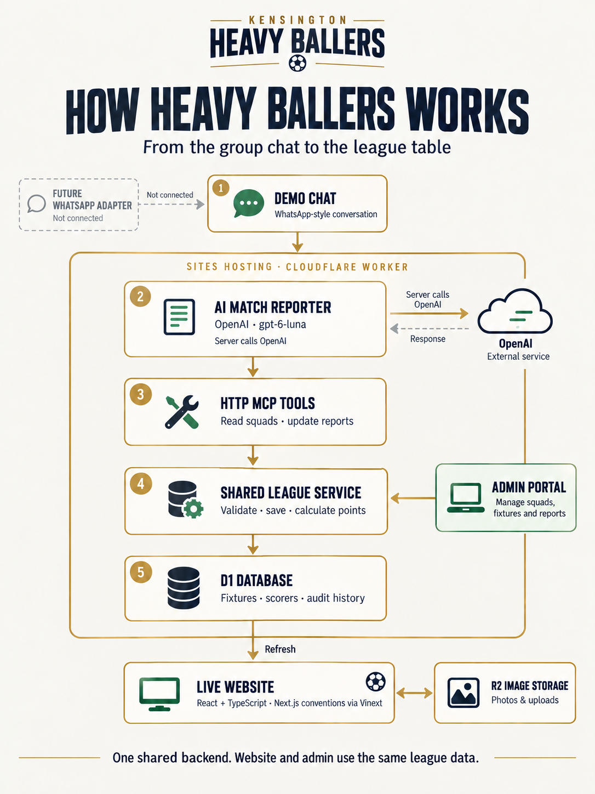

# Kensington Heavy Ballers

A recreation of the public Kensington Heavy Ballers website, with Tuesday/Saturday league archives, a fictional Tuesday Season 2, password-protected admin, persistent D1/R2 storage and a real AI → HTTP MCP → database WhatsApp-style demonstration.

**[Open the live website](https://heavy-ballers-demo.btjones-me.chatgpt.site)** · **[Architecture guide](docs/ARCHITECTURE.md)** · **[Full-size architecture diagram](public/assets/architecture-stack-luna.png)**

**Admin:** https://heavy-ballers-demo.btjones-me.chatgpt.site/admin — initial password `heavyballers`.

**Stack:** React/TypeScript, Next.js App Router conventions via Vinext, Cloudflare Worker/D1/R2, Sites hosting.

- [Admin operating guide](docs/ADMIN.md)
- [Architecture, storage, scoring and spend controls](docs/ARCHITECTURE.md)
- [MCP connection and future WhatsApp adapter](docs/MCP.md)
- [Verification record](docs/VERIFICATION.md)

## Architecture



| Layer | Technology and responsibility |
| --- | --- |
| Website | React, TypeScript and Next.js App Router conventions via Vinext; public leagues, admin portal and a floating WhatsApp-style demo |
| Backend | Cloudflare Worker hosted on Sites; API routes, sessions, validation and AI spend controls |
| Match reporter | OpenAI GPT-6 Luna reads fragmented reports and selects tools from the HTTP MCP server |
| League service | Shared by admin and MCP; validates scores, players and shootouts, with version checks, duplicate protection and change history |
| Storage | D1 stores league records, private demo sessions, conversations and traces; R2 stores admin photo uploads |
| Live presentation | The match-centre iframe reads saved results; tables and scorer rankings are calculated from those results |
| Match image reply | On completion, the backend saves a private report snapshot; the browser renders a downloadable PNG with generated player portraits, scorers, score and updated table into the demo chat |

**Data flow:** player message → Worker agent → authenticated HTTP MCP → league service → D1 → live website and match-summary image.

Each visitor gets an independent fictional season. The agent's requests, tool payloads, responses and timings appear in the activity view. API credentials stay on the server. The chat is simulated; a future WhatsApp adapter can supply the same message events without changing the league rules.

See the [architecture guide](docs/ARCHITECTURE.md) for storage, scoring and budget controls, and the [MCP guide](docs/MCP.md) for endpoints and integration details. On the [live site](https://heavy-ballers-demo.btjones-me.chatgpt.site), open **How it works** from the right-hand tray to explore the stack.

## Run locally

Use Node 22.13 or newer. Run `npm run install:ci`, configure ignored `.dev.vars` from `.env.example`, run `npm run db:local` to apply D1 migrations, then `npm run dev -- --host 127.0.0.1 --port 3000`. Set `APP_ORIGIN` to that exact origin. Secrets must be configured separately in Sites for production.

`/admin` uses the server-configured password (initial demo password: `heavyballers`). No visitor login is required. This is a separate demonstration site; the original website and real WhatsApp chats are not modified.

## Verify

```sh
npx tsc --noEmit
npm test
npm run build
```

Each browser tab receives a private fictional season, conversation and activity log, retained across refreshes for up to 24 hours. Reset demo in the drawer starts a fresh private season without changing anyone else’s results. The monthly £5 AI allowance remains shared across the site and cannot be reset by visitors.

All source photography and branding were collected from the referenced original public website for this requested recreation. Invented chat content contains no private message history or phone numbers. Historical source records with incomplete scorers or missing shootouts are explicitly flagged.

### Live AI smoke tests (opt-in)

Run `npm run test:live` to build the production Worker and test its real HTTP endpoints using GPT-6 Luna, HTTP MCP and an isolated local D1 database. The dedicated key is read from `.dev.vars` or `OPENAI_API_KEY`, never printed. Production data is untouched.

The test gateway enforces a **$0.20 cumulative ceiling** with reservations before every paid request, conservative token prices and no automatic API retries. `qa/live-smoke-budget.json` persists the allowance across reruns, including uncertain calls; rerunning does not reset the budget. Keep this ledger for the authorized test run. Start a fresh ledger only for a separately approved budget.

`qa/live-smoke-report.json` contains the inputs, replies, persisted fixture snapshots, actual MCP response codes/timings and final assertions. The test reuses the UI’s exact five-message script and also checks ambiguous names, unknown players followed by a shootout, first-person reports, aliases, corrections, duplicate delivery, private-session isolation and reset. It verifies each intermediate save and final 3/1 match points, not just HTTP success. The readiness client reads the live baseline and acknowledges the normal presentation endpoint; visual animation checks remain separate.
